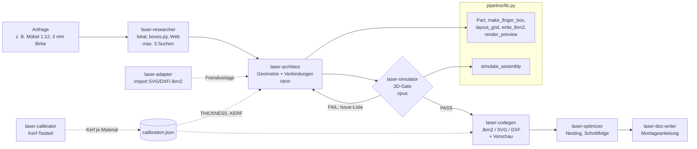
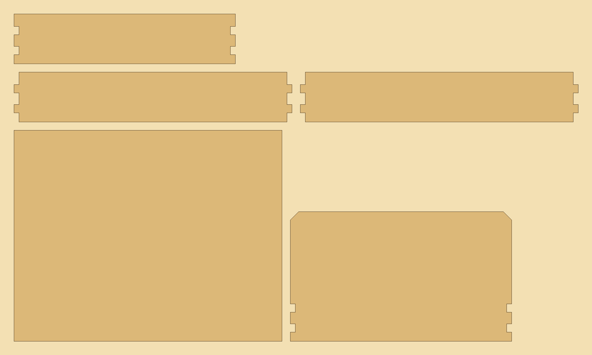
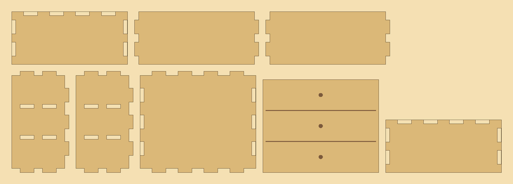
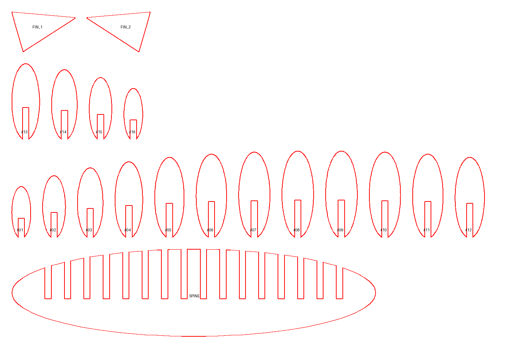
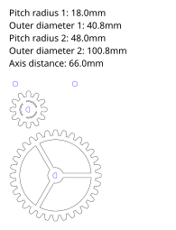
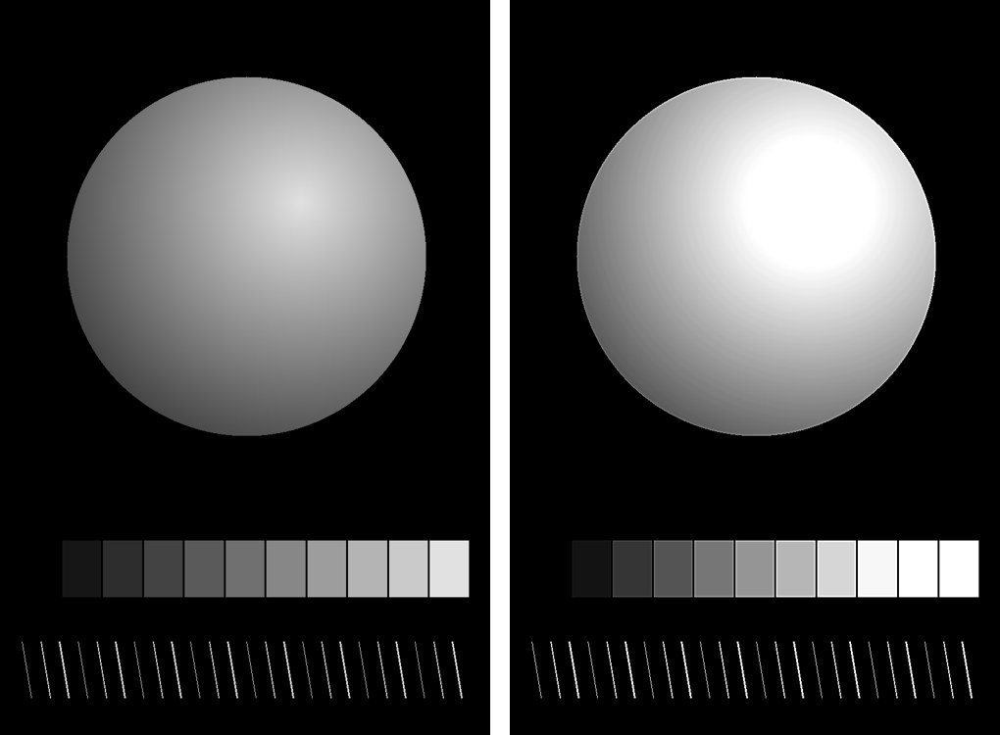

# laser-agent-pipeline

> **EN (TL;DR):** A multi-agent pipeline for laser-cut templates (LightBurn `.lbrn2`, SVG, DXF).
> Eight Claude Code subagents split the work into research, design, a mandatory 3D assembly
> simulation gate, code generation, kerf calibration, nesting, documentation and import. The gate
> is real code: a simulator that rejects colliding parts and joints without contact, verified by
> negative tests. Three skills cover mechanics via boxes.py, photo prep for slate engraving and
> slicing 3D meshes into slot-together figures. Python, 18 tests. Physical cuts are not yet
> verified; all machine values are starting points.

- **Rolle:** Konzept, Agenten-Design, Implementierung und Tests (Jens Geerkens)
- **Entstanden:** Mai 2026, für eigene Laser-Projekte
- **Status:** Entwurfs- und Simulationsstand. Alle 9 Beispielstücke bestehen den Simulator, ein
  realer Schnitt mit kalibriertem Kerf steht noch aus (siehe [Offene Punkte](#offene-punkte)).

---

## Ausgangslage

Beim Erzeugen von Laser-Cut-Vorlagen per Code wiederholen sich dieselben Fehler: Zwei Teile tragen
an derselben Verbindung einen Zapfen, ein Kopfteil passt durch keinen geschlossenen Schlitz, eine
Kreuzverbindung ist als Innenloch gezeichnet und lässt sich nicht stecken. In 2D sieht jede dieser
Vorlagen korrekt aus. Der Fehler zeigt sich erst beim Zusammenbauen.

**Ziel:** Eine Vorlage gilt erst als fertig, wenn ein Prüfschritt ihre Montierbarkeit im Raum
bestätigt hat. Die Arbeit ist auf Agenten mit klaren Zuständigkeiten verteilt, und keiner davon
darf das Prüf-Gate überspringen.

## Architektur



| Baustein | Entscheidung | Warum |
|---|---|---|
| Orchestrierung | **Claude-Code-Subagenten**, sequentiell von der Hauptsitzung aufgerufen | Jede Rolle hat eigene Werkzeuge, eigenen Kontext und eine feste Ausgabeform, die der nächste Schritt weiterverarbeitet |
| Modellwahl | **opus** für Architect und Simulator, **sonnet** für die übrigen sechs | Räumliches Schließen über mehrere Schritte nur dort, wo es gebraucht wird |
| Prüf-Gate | **Simulator als Code**, nicht als Einschätzung eines Modells | Ein Exit-Code entscheidet, ob ein Design weitergeht; der Architect darf ohne PASS nicht "fertig" melden |
| Geometrie | Eigene Python-Bibliothek (`Part`, Polygone in Y-UP) | Eine Quelle für alle Stücke, direkt nach `.lbrn2` schreibbar |
| Kalibrierung | Kerf und Maschinenwerte pro Material in einer JSON-Datei | Kein Wert ist im Code fest verdrahtet, eine neue Messung wirkt auf alle Vorlagen |
| Fremdcode | boxes.py nur als externe CLI | Rund 185 fertige Generatoren nutzbar, ohne GPL-Code einzubinden |
| Dateien | Agenten-Ausgaben (codegen, architect, adapter, calibrator, optimizer) heißen `*_generated.lbrn2` | Von Hand in LightBurn bearbeitete Dateien werden nie überschrieben. Die neun Beispielskripte schreiben dagegen feste Namen nach `pipeline/output/`: reproduzierbare Artefakte, die jeder Lauf (auch `pytest`) neu erzeugt und die nicht von Hand bearbeitet werden |

## Rollen der Agenten

| Agent | Aufgabe | Werkzeuge | Ergebnis |
|---|---|---|---|
| [`laser-researcher`](agents/laser-researcher.md) | Erst lokal, dann boxes.py, dann Web (höchstens 3 Suchen und 3 Abrufe); prüft Lizenzen | WebSearch, WebFetch, Read, Grep | Höchstens 250 Wörter mit Top-Empfehlung und Aufwand |
| [`laser-architect`](agents/laser-architect.md) | Entwurf nach fünf Konventionen, ruft den Simulator auf, iteriert bei FAIL | Read, Write, Bash, Agent | Build-Skript, Verifier-Status, Hardware-Liste |
| [`laser-simulator`](agents/laser-simulator.md) | 3D-Prüfung vor jeder Ausgabe | Read, Write, Bash | PASS, PASS WITH WARNINGS oder FAIL mit Issue-Liste |
| [`laser-codegen`](agents/laser-codegen.md) | `.lbrn2`/SVG/DXF mit Y-UP, Bitmap-Flip, Layer aus der Konfiguration | Read, Write, Bash | Datei plus Vorschau-PNG |
| [`laser-calibrator`](agents/laser-calibrator.md) | Testteil mit 7 Slot-Breiten (2,70 bis 3,00 mm), `KERF = THICKNESS - Slot_passend` | Read, Write, Bash | Kerf-Wert je Material |
| [`laser-optimizer`](agents/laser-optimizer.md) | Nesting (Shelf, Guillotine, MaxRects), Löcher vor Außenkontur, Zeitschätzung | Read, Write, Bash | Layout und Kennzahlen |
| [`laser-doc-writer`](agents/laser-doc-writer.md) | Anleitung nach fester Struktur, externe Hardware ausdrücklich | Read, Write, Grep | Markdown-Anleitung |
| [`laser-adapter`](agents/laser-adapter.md) | Import über svgpathtools, ezdxf, ElementTree; Verbindungen nur als Vorschlag | Read, Write, Bash | Python-Datei mit `Part`s |

Details und Abläufe: [agents/README.md](agents/README.md).

## Qualitäts-Gates

### 1. Simulator (Code, Pflicht)

`simulate_assembly()` in [`pipeline/lib.py`](pipeline/lib.py) bekommt die Teile, ihre Lage im
Raum (`AssemblyPosition`: Ursprung und Ebene XY, XZ oder YZ) und die deklarierten Verbindungen
(`Joint`). Implementiert sind:

| Code | Schwere | Prüfung |
|---|---|---|
| `COLLISION` | Fehler | Zwei Teile überlappen im Raum, ohne dass eine Verbindung zwischen ihnen deklariert ist |
| `JOINT_NO_CONTACT` | Fehler | Verbindung deklariert, die Teile berühren sich aber nicht |
| `EXCESSIVE_JOINT_OVERLAP` | Warnung | Überlappung einer Verbindung über 25 % des kleineren Teils, Maße vermutlich falsch |
| `NO_POSITION` | Warnung | Teil ohne Lage im Raum, also nicht prüfbar, und wird so ausgewiesen |

Gewollte Überlappungen (Zapfen im Schlitz) sehen wie Kollisionen aus und werden über die
Verbindungsliste freigegeben. Die Prüfung arbeitet mit achsenparallelen Hüllquadern.

**Spezifiziert, aber noch nicht als Code umgesetzt:** Montagereihenfolge mit Zugangswegen,
Durchsteckprüfung (offener oder geschlossener Schlitz), Tab-/Slot-Maßabgleich je Verbindung und
Dickenkonsistenz. Die Agenten-Definition verlangt diese Punkte als ausgewiesene Sichtprüfung,
bis sie implementiert sind.

### 2. Negativtests: greift das Gate?

[`demo_simulate_broken.py`](pipeline/demo_simulate_broken.py) baut vier absichtlich kaputte Fälle.
Alle vier werden erkannt:

```
FAIL - 1 error(s), 0 warning(s)
  X [COLLISION] Parts 'plate_A' and 'plate_B' overlap by 4800.0 mm³ but no Joint declared between them.
FAIL - 1 error(s), 0 warning(s)
  X [JOINT_NO_CONTACT] Joint declared between 'part_A' and 'part_B' but their 3D bboxes don't actually overlap. Check positions.
PASS WITH WARNINGS - 1 warning(s)
  ! [NO_POSITION] Part 'loose' has no AssemblyPosition, cannot 3D-verify.
PASS WITH WARNINGS - 1 warning(s)
  ! [EXCESSIVE_JOINT_OVERLAP] Joint box_A<->box_B: overlap 3675 mm³ is 77% of smaller part; check that joint dims are correct.
```

### 3. Alle Beispielstücke gegen den Simulator

[`verify_all.py`](pipeline/verify_all.py) positioniert alle neun Möbelstücke im Raum und prüft
sie; Exit-Code 1, sobald eines durchfällt.

```
  PASS  01 Tisch                  (0E 0W)
  PASS  02 Stuhl                  (0E 0W)
  PASS  03 Bett v4                (0E 0W)
  PASS  04 Nachttisch             (0E 0W)
  PASS  05 Schrank                (0E 0W)
  PASS  06 Kommode                (0E 0W)
  PASS  07 Sofa                   (0E 0W)
  PASS  08 Bücherregal            (0E 0W)
  PASS  09 Stehlampe              (0E 5W)

=> 9/9 pieces passed simulator
```

Die fünf Warnungen der Stehlampe sind gewollt: Die Schirmwände werden geklebt, nicht gesteckt,
haben deshalb keine Lage im Raum und werden als nicht prüfbar ausgewiesen statt stillschweigend
durchgewinkt.

### 4. Testsuite

`python -m pytest` führt 18 Tests aus (Stand 30.09.2026, 18/18 grün unter Windows):

| Datei | Prüft |
|---|---|
| `test_snapshots.py` (13) | Jedes der 9 Build-Skripte läuft, die Vorschau weicht höchstens 1 % von der eingefrorenen Baseline ab; Bett v4 besteht den Simulator; die vier Negativfälle werden erkannt; die boxes.py-Bridge liefert 6 Teile für eine geschlossene Box; `verify_all` meldet 9/9 |
| `test_skills.py` (5) | Beispiel-Kalibrierung lädt und ist als unkalibriert markiert; `lib.py` liest die Kalibrierung aus `LASER_CALIBRATION`; die Foto-Vorlage enthält keinen Dateiverweis; `prep.py` schreibt keine lokalen Pfade in `.lbrn2`; `mesh-slice` zerlegt einen synthetischen Körper |

Die Tests laufen mit `calibration.example.json`, damit das Ergebnis nicht von der lokalen Maschine
abhängt. Ein GitHub-Actions-Workflow ist vorbereitet.

## Designregeln

Die Regeln sind aus konkreten Fehlern entstanden und stehen vollständig in
[docs/design-rules.md](docs/design-rules.md). Die wichtigsten:

| Regel | Inhalt | Ursprung |
|---|---|---|
| **One-sided Tabs** | Pro Verbindung trägt genau ein Teil den Zapfen, das andere den Schlitz | Alle vier Box-Möbel hatten in der ersten Fassung Zapfen gegen Zapfen |
| **Box-Konvention** | Seitenwände tragen alle Zapfen, Deckel/Boden/Einlegeböden nur Schlitze, Rückwand Zapfen oben/unten und Innenschlitze links/rechts | Umgesetzt einmal in `make_finger_box()` für vier Möbel |
| **Corner-Ownership** | Eine Wandrichtung hat die volle Länge, die andere ist um 2 × Materialstärke kürzer | Bett v4, Sofa |
| **Kantenoffene Kreuzkerben** | Cross-Lap-Kerben gehören in die Außenkontur, nie als Innenloch | Stehlampe v1 |
| **Kein Durchstecken durch geschlossene Schlitze** | Ist der Körper breiter als der Hals, muss der Schlitz offen sein | Bett v2 |
| **Montagereihenfolge** | Bei geschlossenen Boxen Einlegeböden vor dem Deckel einsetzen | Box-Möbel |
| **Gravuren nach dem Layout** | Gravurlinien aus der finalen Teilposition berechnen | Kommode, Sofa |
| **Y-UP** | LightBurn rechnet mit Y nach oben; Bitmaps vor dem Einbetten spiegeln | Format-Eigenheit |

### LightBurn-Format

Das `.lbrn2`-Format ist kaum dokumentiert. Die Pipeline schreibt es direkt als XML:
`CutSetting`-Layer, `Shape Type="Path"` mit `VertList`/`PrimList`, Y-UP-Koordinaten. Bei Bitmaps
gilt bei einer XForm-Skala von etwa 0,1: W-Attribut = Anzeigemaß in mm × 10.

## Beispiel-Ergebnisse

Alle Bilder sind Renderings aus dem Code dieses Repositorys und lassen sich mit den Skripten neu
erzeugen.

**Bett v4** (5 Teile, Maßstab 1:12, 3 mm Sperrholz): Seitenteile mit je zwei Eckzapfen,
Kopf- und Fußteil mit passenden Kerben, Bodenpanel liegt im Rahmen.



**Kommode** aus `make_finger_box()` mit zwei Einlegeböden und graviertem Frontpanel:



**mesh-slice** auf einem synthetischen Demokörper: 1 Rücken, 16 Spanten, 2 Seitenflossen.



**laser-mech:** Zahnradpaar 12/32, Modul 3, direkt aus boxes.py:



**laser-prep** mit einem synthetischen Testmotiv (Verlaufskugel, Graukeil, Linienraster):
links der Zuschnitt, rechts das aufbereitete Gravurbild.



Zu jedem Möbelstück gibt es eine Montageanleitung im Format des `laser-doc-writer` in
[pipeline/anleitungen/](pipeline/anleitungen/).

## Skills

| Skill | Zweck | Kern |
|---|---|---|
| [`laser-mech`](skills/laser-mech/SKILL.md) | Zahnräder, Getriebe, Riemenscheiben, Kurbeln | `run_boxes.py` (list, params, run; `.lbrn2` als Standard), `crank.py` mit shapely |
| [`laser-prep`](skills/laser-prep/SKILL.md) | Foto-Gravur auf Schiefer | Freistellen mit rembg, Auto-Crop 2:3, Graustufen, Kontrast, Schärfen, DPI-Prüfung, Einbettung in `.lbrn2` |
| [`mesh-slice`](skills/mesh-slice/SKILL.md) | 3D-Mesh zu Steckfigur | trimesh-Schnitte, morphologische Bereinigung, Halbüberblattungs-Slots, SVG + `.lbrn2` |

## Repository-Struktur

```
agents/                  8 Agenten-Definitionen + Übersicht
skills/                  laser-mech, laser-prep, mesh-slice
pipeline/
  lib.py                 Geometrie, Layout, .lbrn2-Ausgabe, Vorschau, Simulator
  boxes_bridge.py        boxes.py-SVG zu Part-Objekten
  01_…09_*.py            neun Beispielmöbel (Maßstab 1:12)
  verify_all.py          Simulator über alle Stücke
  demo_simulate_*.py     Positiv- und Negativdemo des Simulators
  anleitungen/           Montageanleitungen
  output/, previews/     reproduzierbare .lbrn2-Dateien und Renderings, bei jedem Lauf neu erzeugt
  tests/                 pytest + Snapshot-Baselines
examples/                Ergebnisse der Skills mit synthetischen Eingaben
tools/                   Erzeugung von Foto-Vorlage und Demo-Eingaben
docs/design-rules.md     Designregeln und Final-Checkliste
calibration.example.json Format der Kalibrierdatei
```

## Schnellstart

```bash
pip install -r requirements.txt
python -m pytest                          # 18 Tests
python pipeline/verify_all.py             # Simulator über alle Stücke
python pipeline/demo_simulate_broken.py   # Negativfälle
python pipeline/03_bett.py                # .lbrn2 + Vorschau neu erzeugen
```

Die Kalibrierung wird aus `LASER_CALIBRATION` gelesen, sonst aus `~/.laser/calibration.json`,
sonst gelten die Startwerte (3 mm, Kerf 0,15 mm).

## Offene Punkte

- **Kein realer Schnitt belegt.** Die Physik ist bisher nur simuliert. Alle Kerf-Werte in
  `calibration.example.json` sind Startwerte (`calibrated_at: null`), der Kerf-Test am echten
  Material steht aus.
- **Maschinenwerte sind Startwerte.** Zielmaschine ist ein 65-W-CO2-Laser (Monport Reno 65 Pro,
  LightBurn 2.0). Geschwindigkeiten und Leistungen in Vorlagen und Doku sind Ausgangswerte, keine
  Messergebnisse.
- **Simulator unvollständig:** Montagereihenfolge und Durchsteckprüfung stehen in der Spezifikation,
  nicht im Code. Die Kollisionsprüfung nutzt Hüllquader und kann bei schrägen oder verschachtelten
  Teilen zu grob sein.
- **Kerf-Testteil:** Im Calibrator spezifiziert, als Generator noch nicht im Repository.
- **Optimizer:** MaxRects-Nesting und Zeitschätzung sind spezifiziert; im Code steht bisher das
  Shelf-Packing in `layout_grid()`. Die Beispielzahlen in den Agenten-Ausgabeformaten sind
  Illustrationen.
- **Roadmap:** 3D-Unfolder (Flat-Pack aus einem 3D-Modell), constraint-basierter Entwurf,
  Live-Vorschau mit Datei-Watcher, Brücke zu einer CNC-Fräse.

## Lizenz und Abhängigkeiten

Eigener Code unter der [MIT-Lizenz](LICENSE).
[boxes.py](https://github.com/florianfesti/boxes) (Florian Festi, GPL-3.0) wird nur als externes
Programm aufgerufen und nicht mitgeliefert. `run_boxes.py` lässt den Attributionsblock von boxes.py
in `.lbrn2`-Dateien standardmäßig stehen; `--strip-notes` entfernt ihn auf Wunsch.

---

*Fragen zum Projekt: jens@geerkens.ai*
